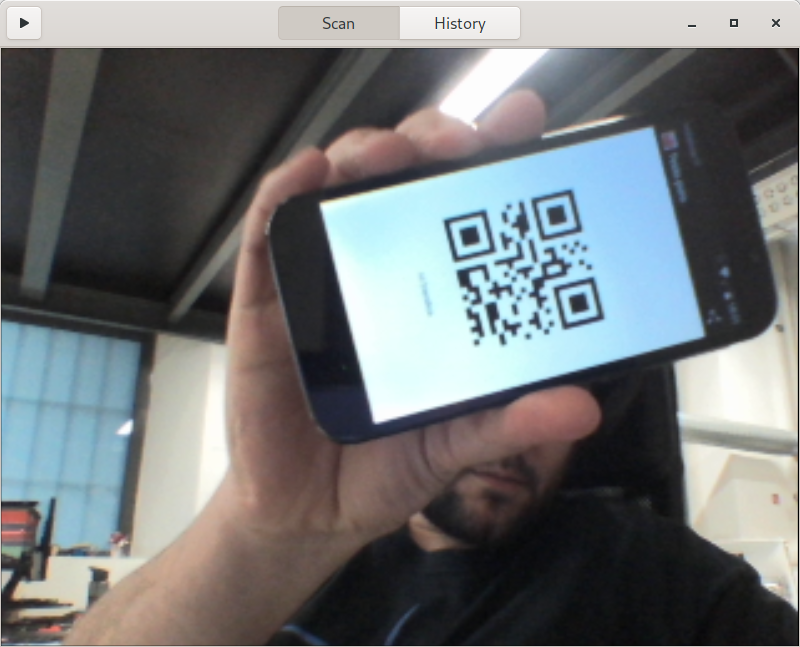

**Cuer** is a QRCode reader application for the GNOME desktop

[more screenshots](screenshots/)

## Requirements:

- gstreamer >= 1.0
- [gst-plugin-qrcode](https://github.com/fabrixxm/gst-plugin-qrcode) >= 0.2.0 ([AUR](https://aur.archlinux.org/packages/gst-plugin-qrcode/))
- Gtk >= 3.10
- [libhandy](https://source.puri.sm/Librem5/libhandy) >= 0.0.8 

to build:

- Vala
- Meson
- Ninja
- GNOME Builder

## Build

	$ meson builddir
	$ cd builddir
	$ ninja
	$ ./src/cuer

or use GNOME Builder.
