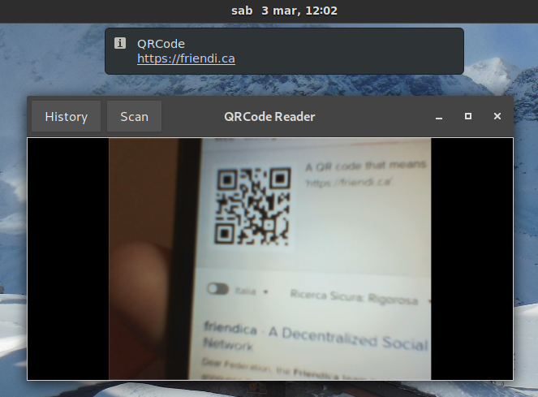

# Cuer

Cuer is a QRCode reader application for the GNOME desktop wich uses the webcam

## Requirements:

- gstreamer >= 1.0
- [gst-plugin-qrcode](https://github.com/fabrixxm/gst-plugin-qrcode) ([AUR](https://aur.archlinux.org/packages/gst-plugin-qrcode/))
- Gtk >= 3.10

to build:

- Vala
- Meson
- Ninja
- GNOME Builder

## Build

	$ meson builddir
	$ cd builddir
	$ ninja
	$ ./src/cuer

or use GNOME Builder.
